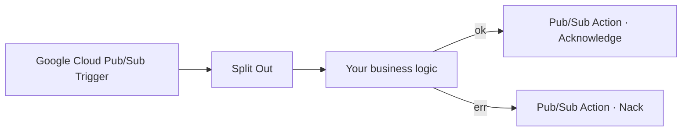

# n8n-nodes-gcp-pubsub

Community n8n nodes for Google Cloud Pub/Sub:

- **Google Cloud Pub/Sub Trigger** — starts a workflow when a message arrives on a subscription, emitting the payload along with the `ackId` required to acknowledge it later.
- **Google Cloud Pub/Sub Action** — acknowledges, nacks (redelivers immediately) or extends the ack deadline of a specific message.

The two nodes are designed to work together: the trigger receives messages **without** acknowledging them, and the action node decides per-message how to resolve each lease after your workflow has finished processing it.

## Contents

- [Installation](#installation)
- [Credentials](#credentials)
- [Quick start](#quick-start)
- [Trigger output](#trigger-output)
- [Action node operations](#action-node-operations)
- [Ack lifecycle and guarantees](#ack-lifecycle-and-guarantees)
- [IAM roles](#iam-roles)
- [Troubleshooting](#troubleshooting)
- [Development](#development)

## Installation

Via the n8n UI: **Settings → Community Nodes → Install** and enter the package name `n8n-nodes-gcp-pubsub-x78`.

From the CLI:

```bash
npm install n8n-nodes-gcp-pubsub-x78
```

## Credentials

Both nodes expose an **Authentication** dropdown with two branches:

- **Service Account / ADC** → uses the **Google Cloud Pub/Sub API** credential, which supports three sub-modes selected by its **Auth Method** dropdown.
- **OAuth2** → uses the **Google Cloud Pub/Sub OAuth2 API** credential, which authenticates as a Google user via n8n's OAuth2 flow.

You only need to configure the credential that matches the branch you pick on each node. Switching between them is a one-click change; nothing is lost.

### Google Cloud Pub/Sub API (service account / ADC)

Pick one **Auth Method**:

- **Service Account Key (Email + Private Key)** — paste the `client_email` and `private_key` from a downloaded JSON key into two separate fields. Escaped `\n` sequences in the private key are handled automatically. Use this when you prefer not to paste the full JSON blob. This is the default and is backwards-compatible with credentials created in earlier versions of the package.
- **Service Account JSON** — paste the entire JSON key as downloaded from Google Cloud. `project_id`, `client_email` and `private_key` are extracted automatically, so the **Project ID** field can usually stay blank.
- **Application Default Credentials** — no key material stored in n8n. The Google client library resolves credentials from the environment at runtime in this order: the `GOOGLE_APPLICATION_CREDENTIALS` env var, the gcloud user credentials file, then the metadata server when running on GCE / GKE / Cloud Run. Pair this mode with [Workload Identity](https://cloud.google.com/kubernetes-engine/docs/concepts/workload-identity) when hosting n8n on GKE or Cloud Run so credentials never leave Google Cloud. **Not available on n8n Cloud** — ambient credentials are not exposed to community nodes there.

**Project ID** on this credential is optional; if blank it is inferred from the pasted JSON (Service Account JSON mode) or from ADC (`auth.getProjectId()`). Each node can still override it.

### Google Cloud Pub/Sub OAuth2 API

Use this when you want the nodes to act on behalf of a human Google user (for example a developer testing a workflow against their own subscriptions) rather than a machine identity.

1. In **Google Cloud Console → APIs & Services → Credentials**, create an **OAuth 2.0 Client ID** of type **Web application**.
2. Add your n8n callback URL as an **Authorised redirect URI**. n8n shows the exact URL in the credential editor (typically `https://<your-n8n-host>/rest/oauth2-credential/callback`).
3. Enable the **Cloud Pub/Sub API** on the same project (**APIs & Services → Library**).
4. In n8n, create a **Google Cloud Pub/Sub OAuth2 API** credential and paste the **Client ID** and **Client Secret**. All other OAuth2 fields (auth URL, token URL, scope, `access_type=offline&prompt=consent`) are pre-filled. The scope is pinned to `https://www.googleapis.com/auth/pubsub`.
5. Fill in **Project ID** — OAuth2 tokens are not scoped to a project, so this field is required (or must be set per node).
6. Click **Sign in with Google** and approve the consent screen.

> **IAM caveat** — OAuth2 authenticates as the *user*, so `roles/pubsub.subscriber` (and, if you auto-create subscriptions, `roles/pubsub.editor`) must be granted to the Google account that signs in, **not** to a service account. If your org uses Google Groups, granting the role to the group works too.

## Quick start



1. Add a **Google Cloud Pub/Sub Trigger** node.
2. Fill in **Topic**, **Subscription**, and (optionally) override **Project ID**.
3. Connect it to a **Split Out** node if your workflow expects one item per message.
4. Process messages with any n8n nodes you like.
5. On the success branch, add a **Google Cloud Pub/Sub Action** node with **Operation = Acknowledge**. Its defaults already reference `{{$json.ackId}}` and `{{$json._pubsub.subscription}}`, so no further configuration is required.
6. On the error branch, add another action node with **Operation = Nack (Return Immediately)** so Pub/Sub redelivers the message.

If a workflow run ends without reaching either branch (e.g. the n8n instance restarts), Pub/Sub will automatically redeliver once the ack deadline expires.

## Trigger output

Each message is emitted as one item with the following shape:

```json
{
  "messageId": "12345",
  "ackId": "Rd1-AUYeN...",
  "publishTime": "2026-04-19T12:34:56.789Z",
  "orderingKey": null,
  "deliveryAttempt": 1,
  "attributes": { "type": "order.created" },
  "data": "{\"orderId\":\"abc\"}",
  "_pubsub": {
    "projectId": "my-proj",
    "subscription": "projects/my-proj/subscriptions/my-sub"
  }
}
```

Enable **Decode JSON** on the trigger to have `data` automatically `JSON.parse`d. On parse failure the raw string is preserved and `jsonDecodeFailed: true` plus `jsonDecodeErrorMessage` are added to the item.

`_pubsub.subscription` is the full Pub/Sub resource name and is the only identifier the action node needs to route its requests.

### Trigger options

| Option | Default | Purpose |
|---|---|---|
| Auto-Create Subscription | on | Create the subscription on the topic if it doesn't exist. Turn off to fail fast if misconfigured. |
| Ack Deadline (Seconds) | 60 | Used only when the subscription is auto-created. |
| Max Extension (Minutes) | 10 | How long the client keeps extending the ack deadline while waiting for the ack. Set higher than the slowest expected workflow run. |
| Max Outstanding Messages | 100 | Flow control: cap on unacked messages held in memory. |
| Max Outstanding Bytes | 100 MiB | Flow control: cap on cumulative size of unacked messages. |

## Action node operations

The action node takes one of three operations, defaulting its inputs to the fields emitted by the trigger:

- **Acknowledge** — `POST …/subscriptions/{sub}:acknowledge` — tells Pub/Sub the message was handled successfully.
- **Nack (Return Immediately)** — `POST …/subscriptions/{sub}:modifyAckDeadline` with `ackDeadlineSeconds: 0` — releases the lease so Pub/Sub redelivers as soon as possible.
- **Extend Ack Deadline** — same endpoint with a user-supplied `ackDeadlineSeconds` (0–600). Use it when a downstream step is slow and you want to be explicit about holding the lease, on top of the trigger's automatic extension.

Items that share a `subscription` (and deadline, for `Extend Ack Deadline`) are batched into a single REST call by default. Disable **Batch Requests** under **Options** to force one call per item.

On success the action node attaches `ok: true`, `status: 200`, `operation`, `subscription` and `ackId` to the item. On failure it raises a `NodeOperationError` pointing at the offending item (respecting the workflow's **Continue on Fail** setting).

## Ack lifecycle and guarantees

- **Delivery guarantee**: at-least-once. Duplicates can occur (trigger restart mid-processing, slow consumer exceeding `maxExtensionMinutes`, Pub/Sub redelivery). Design your workflow to be idempotent.
- **ackId validity**: an `ackId` is a handle to one specific delivery and stays valid as long as the trigger's subscriber holds the lease and the ack deadline hasn't expired. The trigger's client library auto-extends the deadline up to `Max Extension (Minutes)` while the subscriber is alive.
- **Ack done by the action node** travels over the public Pub/Sub REST endpoint, so it works regardless of which n8n worker the action runs on (this matters in queue-mode deployments).
- **If the trigger restarts** mid-flight, in-flight `ackId`s become invalid. A late ack will fail with `FAILED_PRECONDITION` and Pub/Sub will redeliver after the ack deadline expires. The action node surfaces this as a typed error so you can branch on it.
- **Ordering keys**: a nack on a message with an `orderingKey` blocks subsequent messages with the same key until the nacked message is redelivered. Keep this in mind when designing retry logic.

## IAM roles

Grant the principal used by the credential the minimum roles needed:

| Feature | Role |
|---|---|
| Consume messages, ack/nack/modify deadline | `roles/pubsub.subscriber` |
| Auto-create subscription from the trigger | `roles/pubsub.editor` (or a custom role with `pubsub.subscriptions.create` and `pubsub.topics.attachSubscription`) |

The *principal* depends on the auth mode:

- **Service Account Key / Service Account JSON** — grant roles to the service account whose key you pasted (`client_email`).
- **Application Default Credentials** — grant roles to whichever identity the environment resolves to (the Workload Identity-bound service account on GKE / Cloud Run, or the user in `gcloud auth application-default login`).
- **OAuth2** — grant roles to the Google user (or their group) who authorises the credential. Service-account grants do **not** apply.

Turn **Auto-Create Subscription** off in the trigger if you don't want to grant editor-level permissions and prefer to create subscriptions out-of-band.

## Troubleshooting

**`FAILED_PRECONDITION: You are attempting to acknowledge with expired ackId`**
The message's lease expired before the action node acked it. Raise **Max Extension (Minutes)** on the trigger so the client library keeps extending the deadline for longer, or simplify the downstream workflow so it finishes sooner. Pub/Sub will redeliver the message.

**Private-key auth errors (`invalid_grant`, `PEM_read_bio_PrivateKey`)**
Make sure the **Private Key** credential field contains the full PEM, BEGIN/END markers included. Escaped `\n` sequences are converted automatically; triple-escaping them (for example by wrapping the value in extra quotes before pasting) will break parsing.

**Trigger stays quiet while messages are visible in the console**
Check that the subscription exists and that the service account has `roles/pubsub.subscriber` on it. If auto-create is off, also verify that the subscription names match exactly (they are case-sensitive).

**Messages show up again after processing**
Either the action node did not run (check your error branch wiring) or the ack call failed (inspect the item's `ok`, `status`, and `message` fields). Remember: delivery is at-least-once.

## Development

```bash
npm install
npm run dev           # hot-reload n8n with the nodes loaded
npm run build         # build into dist/
npm run lint          # n8n community-node lint + eslint
npm run lint:fix      # auto-fix where possible
```

Code layout:

- [`credentials/GcpPubSubApi.credentials.ts`](credentials/GcpPubSubApi.credentials.ts) — service-account credential (key / JSON / ADC sub-modes).
- [`credentials/GcpPubSubOAuth2Api.credentials.ts`](credentials/GcpPubSubOAuth2Api.credentials.ts) — OAuth2 credential preset for Google + Pub/Sub scope.
- [`nodes/GcpPubSubTrigger/GcpPubSubTrigger.node.ts`](nodes/GcpPubSubTrigger/GcpPubSubTrigger.node.ts) — streaming-pull trigger.
- [`nodes/GcpPubSubAction/GcpPubSubAction.node.ts`](nodes/GcpPubSubAction/GcpPubSubAction.node.ts) — ack/nack/extend action.
- [`nodes/shared/auth.ts`](nodes/shared/auth.ts) — `buildPubSubAuth` dispatcher that returns `{ authClient, pubsub, projectId }` for all four auth modes.
- [`nodes/shared/pubsubRest.ts`](nodes/shared/pubsubRest.ts) — thin REST wrapper around `:acknowledge` and `:modifyAckDeadline`.

The project depends on `@google-cloud/pubsub` (for streaming pull) and `google-auth-library` (for signing JWTs used by the REST ack calls). These external runtime dependencies mean the package is not eligible for the "n8n Cloud verified" status today; self-hosted n8n instances install it without issue.

## License

[MIT](LICENSE.md)
